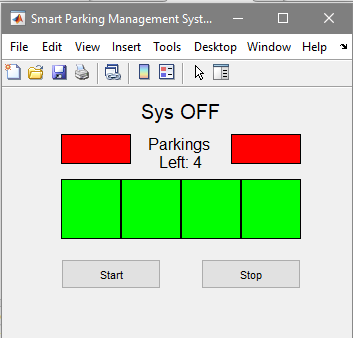
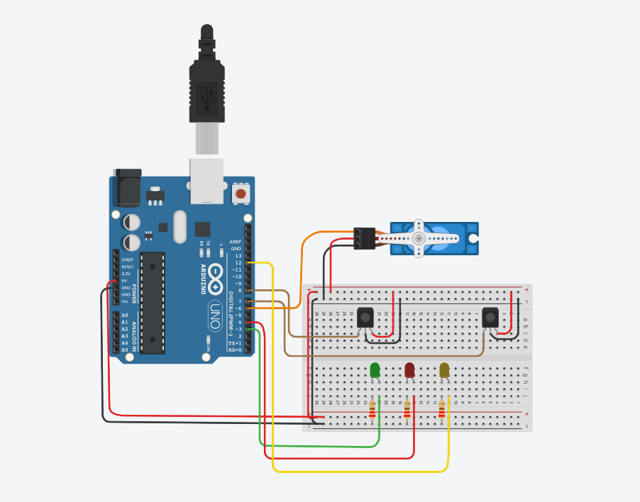
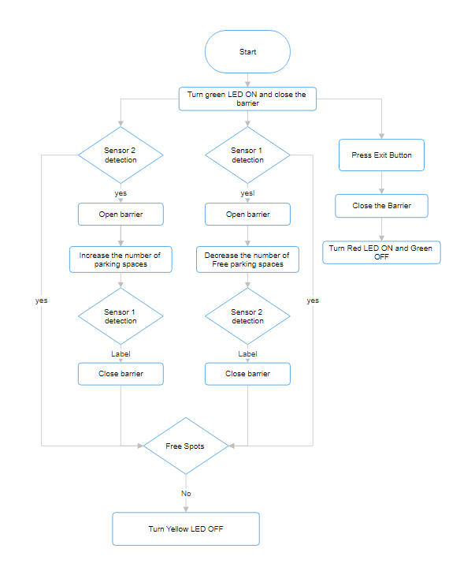

# Smart-Parking-Management-System
## Abstract
The purpose of this project is to design and implement a Smart Parking Management System integrating Arduino and MATLAB technologies. This inventive smart system aims to solve parking management problems and challenges by proposing an intelligent, cost-effective solution. With the help of MATLAB GUI, the system would be controlled and monitored, allowing the optimization of parking space utilization while minimizing costs. This project serves as a useful demonstration of the microcontroller technology in enhancing real-life problems, offering smart and efficient solutions.

## Introduction and Objectives
Nowadays almost every family own a car or two to be used in the transportation needs. Widening and generalizing this scope to describe for example big cities will definitely cause serious problems that start with traffic jam, unnecessary accidents and the decrease and unorganized parking of parks in the streets. In order to find a practical solution, a Smart Parking Management System is designed and explained in this report. The objectives of the system can be summarized in the following:
1.	Design a Low-cost and effective solution using Arduino.
2.	Integrate MATLAB to create a Graphical user Interface to control the system and receive feedback.
3.	Implement a prototype of the design to be tested in a small real-time simulation to assess the effectiveness of the Control system.

## Requirements
Hardware Requirements:

1.	Arduino Uno R3 x1                                                                                            
2.	Test Board x1
3.	IR Sensor x2
4.	Green LED x1
5.	Red LED x1
6.	Yellow LED x1
7.	Jumper Wires
8.	Servo Motor x1
9.	Resistor 220 Ω x3

Software Requirements:

1.MATLAB

## Project Development Procedures
This project consists of two parts, the GUI using MATLAB design and the system design and implementation with Arduino microcontroller. We will start by preparing and programming the GUI with MATLAB.
MATLAB enables us to create a graphical user interface that should first of all contain two buttons in order to start and stop the system as needed. In addition to that, the window should also show the status of the system if either “ON” or “OFF”. We can never forget that the GUI will definitely show the vacant and occupied spaces in the parking lot and a text label to indicate the number of free remaining parking lots. This will enable the user to visualize and read the free spaces as the free space will be colored in green and when occupied the slot will turn color into red.



The second part of the system consists of the hardware part. With the help of the Arduino that is a programmable microcontroller that has analog and digital pins that can be configured as inputs or outputs. A servo motor will be attached to the controller acting as the parking barrier that will remain closed until a car enters or leaves the parking. For the purpose of detecting leaving and entering cars, we’ll be using 2 Infrared Sensors that are positioned respectively before and after the barrier, so we’ll be expecting 2 scenarios:
1. Entering Cars:
   If sensor 1 detects then the barrier will open and won’t close until the second sensor detects which means that the car has passed the barrier and is already in the         parking.  If the parking spaces left are equal to zero, the barrier won’t open until a car leaves the parking.
2. Leaving Cars:
   When leaving the parking, it is logical that the 2nd sensor IR sensor will be detecting first. So similarly, when it detects the barrier will open and won’t close until the 1st IR sensor detects the car.

Three LEDs are also implemented: a Green LED stating that the system is ON, a red LED 
Indicating that the system is OFF and finally a Yellow LED turns ON when there are free parking lots inside the parking and will turn OFF if the parking is full.

## Schematic Representation



## Flow Chart



## MATLAB Code

Create a GUI figure
```matlab
fig = figure('Name', 'Smart Parking Management System', 'NumberTitle', 'off', 'Position', [100, 100, 350, 250]);
```
Create Arduino Object
```matlab
a = arduino('COM3', 'Uno','Libraries', 'Servo');
```

Create Arduino Variables
```matlab
ledPinON = 'D3';
ledPinOFF = 'D4';
ledStatus = 'D12';
IR1 = 'D8';
IR2 = 'D7';
servoPin = 'D6';
s = servo(a, servoPin);
```

Define Variables for Servo angle
```matlab
Open = 0.5; % Angle = 90
Close = 0; % Angle = 0
```

Define a Global Variable for controlling the Gate
```matlab
isGateOpen = true;
```

Define Variable for counting the left parkings
```matlab
Parkings = 4;
```

Initialize System States
```matlab
startState = 0; % 0 for off, 1 for on
stopState = 0;  % 0 for off, 1 for on
```

Create "Start" button
```matlab
startBtn = uicontrol('Style', 'pushbutton', 'String', 'Start', 'Position', [60, 50, 100, 30]);
    set(startBtn, 'Callback', @startCallback);
```

Create "Stop" Button
```matlab
stopBtn = uicontrol('Style', 'pushbutton', 'String', 'Stop', 'Position', [200, 50, 100, 30]);
    set(stopBtn, 'Callback', @stopCallback);
```

Create LED Indicators for "Start" and "Stop"
```matlab
startIndicator = uicontrol('Style', 'frame', 'Position', [60, 175, 70, 30]);
set(startIndicator, 'BackgroundColor', 'red'); % Initialize "Start" indicator as red
stopIndicator = uicontrol('Style', 'frame', 'Position', [230, 175, 70, 30]);
set(stopIndicator, 'BackgroundColor', 'red');  % Initialize "Stop" indicator as red
```

Initialize Led State
```matlab
numLEDs = 4;
ledState = zeros(1, numLEDs); % 0 for red, 1 for green
```

Create LED Indicators
```matlab
leds = cell(1, numLEDs);
ledPositions = [60, 100; 120, 100; 180, 100; 240, 100]; % LED positions
for i = 1:numLEDs
   leds{i} = uicontrol('Style', 'frame', 'Position', [ledPositions(i, 1), ledPositions(i, 2), 60, 60]);
   set(leds{i}, 'BackgroundColor', 'green'); % Initialize as red
end
```

Create LED Count Label
```matlab
ledCountLabel = uicontrol('Style', 'text','FontSize',12, 'Position', [145, 165, 70, 40]);
set(ledCountLabel, 'String', ['Parkings Left: ' num2str(Parkings)]);
```

Create Text Label
```matlab
label = uicontrol('Style', 'text', 'String', 'Sys OFF','FontSize',15, 'Position', [130, 210, 100, 30]);
writeDigitalPin(a, ledPinOFF,1);
writePosition(s,Close);
```

Callback Function for the "Start" buttom
```matlab
function startCallback(~, ~)
        if startState == 0
            set(startIndicator, 'BackgroundColor', 'green'); % Turn on the "Start" indicator
            set(label, 'String', 'Sys ON'); % Update the label
            startState = 1;
            
            % If "Start" is pressed, turn off the "Stop" indicator
            set(stopIndicator, 'BackgroundColor', 'red');
            stopState = 0;
            writeDigitalPin(a, ledPinON, 1);
            writeDigitalPin(a, ledPinOFF, 0);
            writeDigitalPin(a, ledStatus, 1);
           
        end
        while startState
            sensor1 = readDigitalPin(a, IR1);
            sensor2 = readDigitalPin(a, IR2);

            if sensor1 == 0 && ~isGateOpen && Parkings >0
                writePosition(s, Open);
                isGateOpen = true;
                for i = 1:numLEDs
                    if ledState(i) == 0
                        set(leds{i}, 'BackgroundColor', 'red'); % Turn on the LED
                        ledState(i) = 1;
                        Parkings = Parkings - 1;
                        set(ledCountLabel, 'String', ['Parkings left: ' num2str(Parkings)]);
                        if Parkings == 0
                            writeDigitalPin(a, ledStatus, 0);
                        end
                        break;
                    end
                end
                pause(0.5);
            elseif sensor2 == 0 && isGateOpen
                writePosition(s, Close)
                isGateOpen = false;
                pause(0.5);
            elseif sensor2 == 0 && ~isGateOpen && Parkings<4
                writePosition(s, Open);
                isGateOpen = true;
                for i = numLEDs:-1:1
                    if ledState(i) == 1
                        set(leds{i}, 'BackgroundColor', 'green'); % Turn off the LED
                        ledState(i) = 0;
                        Parkings = Parkings + 1;
                        set(ledCountLabel, 'String', ['Parkings left: ' num2str(Parkings)]);
                        if Parkings ~= 0
                            writeDigitalPin(a, ledStatus, 1);
                        end
                        break;
                    end
                end
                pause(0.5);
            elseif sensor1 == 0 && isGateOpen
                writePosition(s, Close);
                isGateOpen = false;
                pause(0.5);
            end
        end
    end
```

Callback Function for the "Stop" Button
```matlab
    function stopCallback(~, ~)
        if stopState == 0
            set(stopIndicator, 'BackgroundColor', 'green'); % Turn on the "Stop" indicator
            set(label, 'String', 'Sys OFF'); % Update the label
            stopState = 1;
            
            % If "Stop" is pressed, turn off the "Start" indicator
            set(startIndicator, 'BackgroundColor', 'red');
            startState = 0;
            writeDigitalPin(a, ledPinON, 0);
            writeDigitalPin(a, ledPinOFF, 1);
            writeDigitalPin(a, ledStatus, 0);
            writePosition(s, Close);
        end
    end
end
```

## Conclusion

We conclude that using MATLAB and its Arduino hardware support package can result in very good solutions to the every-day problems we face in real-life, in addition to that MATLAB allows us to create GUIs in order to visualize the aspects and feedback from our system, which makes it user-friendly and easier for the usage among non-technical users.


